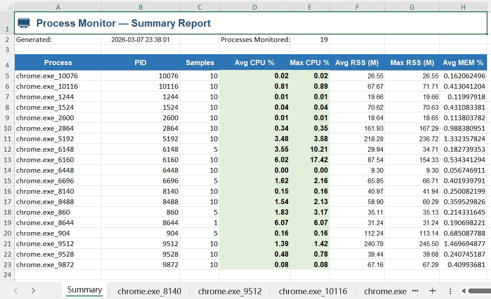
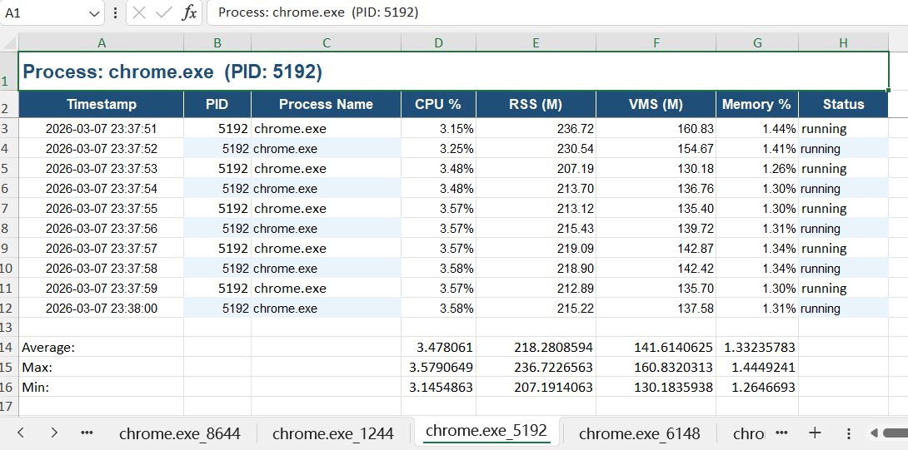

# procmon — Process Monitor

Cross-platform process monitoring tool for Windows, Linux, and macOS.
Collects **CPU usage and memory stats** per process and generates a formatted Excel report.

---

## Features

| Feature | Description |
|---|---|
| Cross-platform | Native support for Windows, Linux, and macOS |
| Multi-process | Monitor multiple processes at once (comma-separated) |
| Real-time output | Prints sampled data to the terminal in real time |
| Excel report | One sheet per process + a Summary sheet |
| Graceful exit | Ctrl+C saves data before exiting |
| Configurable interval | Adjustable sampling interval (default 1s) |

---

## Build

```bash
# Install dependencies
go mod tidy

# Build for current platform
go build -o procmon.exe ./cmd
```

---

## Usage

```bash
# Basic usage (monitor chrome for 60 seconds)
./procmon -p chrome -d 60

# Monitor multiple processes
./procmon -p "python3,nginx" -d 120

# Specify output file
./procmon -p notepad.exe -d 30 -o my_report.xlsx

# Custom sampling interval (2 seconds)
./procmon -p chrome -i 2 -d 60

# Run indefinitely, stop with Ctrl+C
./procmon -p chrome
```

### Flags

| Flag | Description | Default |
|---|---|---|
| `-p` | Process name(s), comma-separated (**required**) | — |
| `-d` | Duration in seconds, 0 = unlimited | `0` |
| `-i` | Sampling interval in seconds | `1` |
| `-o` | Output file path | `procmon_<timestamp>.xlsx` |

### Windows examples

```cmd
procmon.exe -p "chrome.exe,notepad.exe" -d 60
procmon.exe -p explorer.exe -d 120 -o explorer_stats.xlsx
```

---

## Excel report layout

```
procmon_20240101_120000.xlsx
├── Summary          ← Summary of all processes (avg/max CPU & memory)
├── chrome_12345     ← Detailed data for chrome process
├── python3_67890    ← Detailed data for python3 process
└── ...
```

### Summary sheet

| Column | Description |
|---|---|
| Process | Process name (click to jump to detail sheet) |
| PID | Process ID |
| Samples | Number of samples collected |
| Avg CPU % | Average CPU usage |
| Max CPU % | Peak CPU usage |
| Avg RSS | Average physical memory (MB) |
| Max RSS | Peak physical memory (MB) |
| Avg MEM % | Average memory % |

### Process detail sheet

| Column | Description |
|---|---|
| Timestamp | Sample timestamp |
| PID | Process ID |
| Process Name | Process name |
| CPU % | CPU usage |
| RSS (M) | Physical memory (MB) |
| VMS (M) | Virtual memory (MB) |
| Memory % | Memory usage % |
| Status | Process status |

### Screenshots

#### Summary (example)



#### Process detail (example)



---

## Dependencies

- [gopsutil/v3](https://github.com/shirou/gopsutil) — cross-platform process info
- [excelize/v2](https://github.com/xuri/excelize) — Excel file generation

---

## Notes

- **Linux**: Runs without extra permissions (root required to monitor other users' processes)
- **Windows**: Runs directly; process names usually include `.exe` (tool does fuzzy matching)
- CPU usage is based on gopsutil’s calculation; on multicore systems it may exceed 100%
